# Create a Production-Ready, Flattened (Day-Level) Data Warehouse in Google BigQuery

> estimated time to completion: 2-3 hours with due-diligence

> variables to define before beginning: [1] number of data sources [2] knowledge of all data/columns needed for reporting [3] knowledge of how data/columns will move towards reporting [4] familiarity with your data warehouse resource provider

> primary output: a data warehouse in Google Cloud Platform's BigQuery resource

> secondary themes: [1] star schema [2] data naming conventions [3] python module configuration [4] syntactic interoperability (a term I just now learned) between sql and python

We want to create a data warehouse that will allow us to dynamically report upon business kpis based upon variable requests.

Some common reporting requests that will come up include:

* Show me last week's kpis. Compare last week's kpis to the prior 4 week averages and trend the weekly totals over the past 12 months.

* Show me last month's revenue vs. the previous month. But wait - last month had 2 national holidays which skew our numbers to look lower. Control for these holidays.

Man! Where to begin here? Don't sweat it dude - we just need to understand the data allowing us to answer these questions and then operate calculations on that data.

These questions are distinct and will require constant time-wasting modification without a thoughtful approach to formatting your data.

It is up to the analyst to understand how to group their data, but this instruction will work to group dates in a thoughtful manner, identify meaningful website dimensions for future groupings, and joining this information together on a flat level that can be aggregated to any request in the future.

Groupings are key!

In this instruction, we will create a thoughtful - production-ready data warehouse that will save you time and effort in reporting on future requests.

## Understanding how to structure a data warehouse for extensible use.
Review the Star Schema Data Warehousing Structure:

https://en.wikipedia.org/wiki/Star_schema

## Creating Datasets based on Star Schema
Create a Dataset to Store Dimensions

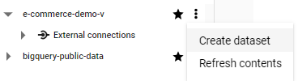

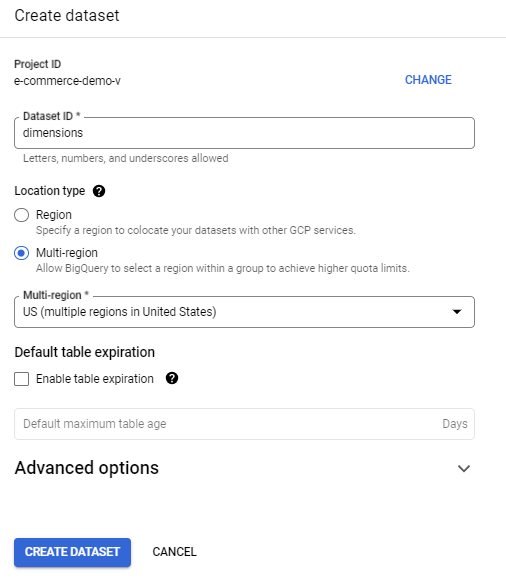

Create a Dataset to Store Facts

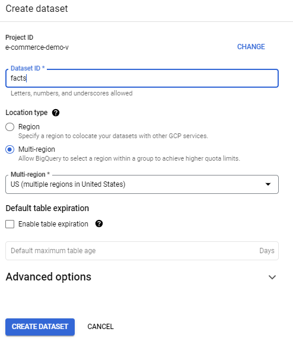

Create a Dataset to Store Raw Data

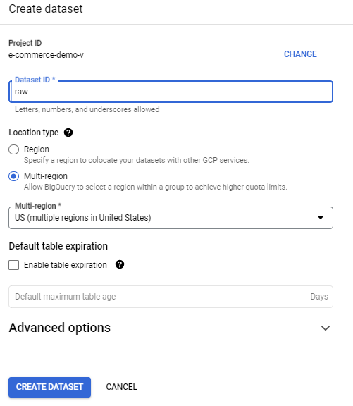

## Create a raw date table in BigQuery using Python

Activate Python virtual environment

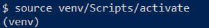

Run the python script to create a date table that classifies business days

Confirm your raw date table is created in the predefined location

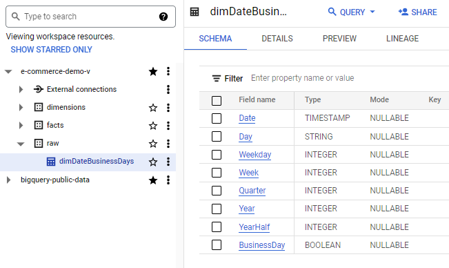

## Create an extensible date table in our Dimension Dataset

Use the d_date.sql file to create an extensible date dimension view that references our raw date table.

Creating this view will allow us to dynamically control for business days and group our facts tables by ranges like week, month, or year.

As you develop your SQL and Python skills you may notice that this view's SQL duplicates the groupings we did in our create table Python script.

This is a great note - you can create and modify data in either SQL or Python. For now it is enough to understand the similarities in our process and familiarize yourself with what works with you.

Take note of the column naming conventions in our new view. Change the schema to anything you would like... you will be joining to these fields frequently.

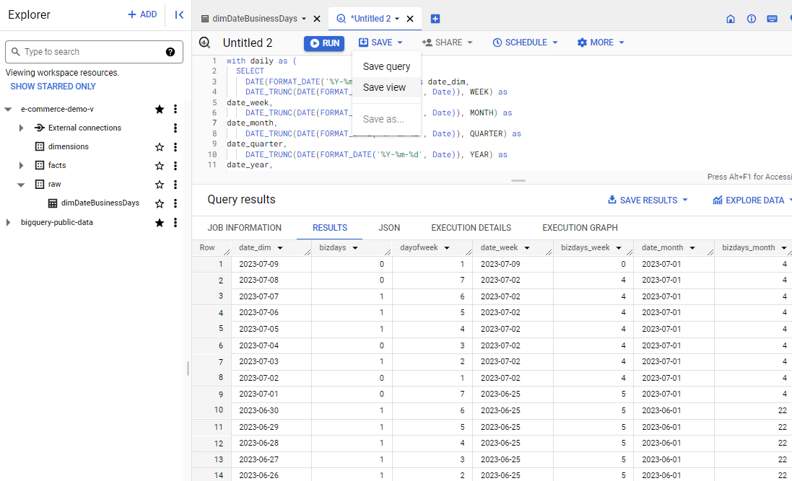

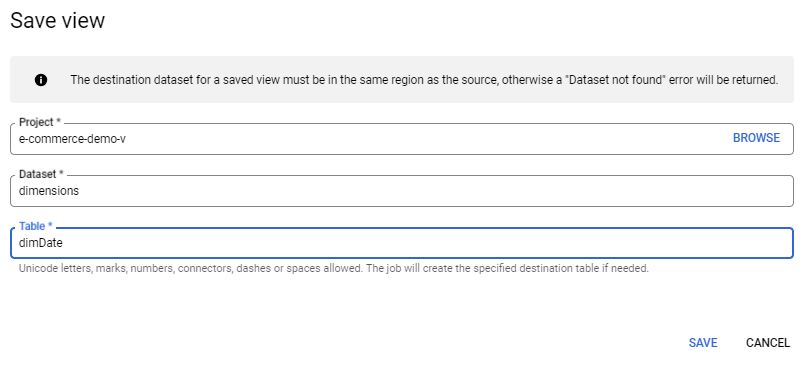

## Create a Google Analytics table in our Fact Dataset

As an analyst you will need to understand from what lens your company views its efforts.

An e-commerce analyst may be interested in reporting on differing efforts based on channel (organic search, paid search, etc.).

In this example we will assume that you are only interested in the Organic and Paid channels. We will create simple flattened fact tables related to these channels.

I encourage you to understand what dimensions are important to understand and modify your fact tables to reflect this importance.

In this example, let's make 2 fact tables. One for a simple daily entry-page level logs of organic and one for simple daily entry-page level logs of cpc traffic.

Based on the sample dataset, here is a breakdown of visit volume for each channel. Remember, we will focus on organic and paid channels, but you may want to include each channel in a larger flattened table. We will keep this example simple and only include a limited number of fields for clarity. In your operations, consider all possible fields that could provide value to your reporting and include them in your facts table.

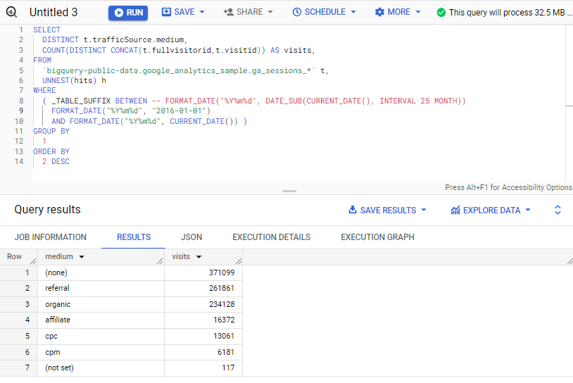

Refer to the f_ga_organic.sql and f_ga_cpc.sql files to save 2 new fact views to your facts dataset.

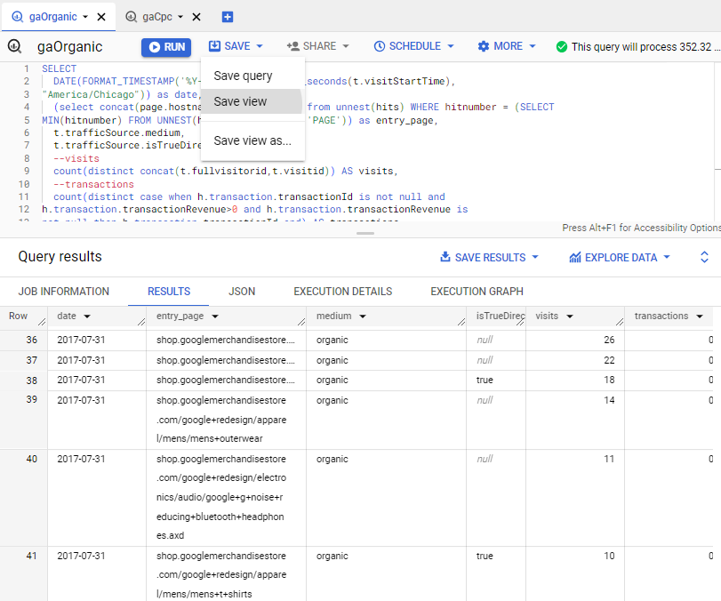

## Scope out Dimensions related to your E-Commerce Pages that will help you Provide Value

In this sample dataset, I do not know much about Google's clothing shop (the site we have Analytics data for).

I will assume it would be worthwhile to define different pagetypes based on what a page is about. This will allow us to monitor traffic and revenue by page intent.

Most e-commerce websites sell products with unique identifiers in the URL. If this is the case with your website, now is the time to define these ids in a dimension table so you can join them to the fact table on a regex extraction of the URL path.

As an example, you may have access to a product table with information like product id, review count, image existance, description text, or attribute text. This is a goldmine for ecommerce analytics and you should (1) extract the product id from the fact table as a column in your fact's dimension table and (2) extract the product id from your product information table along with it's associated field's in your product's dimension table.

This sample dataset has no product identifiers so we will simply define pagetypes columns in a new fact-based dimension table that will provide meaningful dimensions that we can report upon and modify in the future.

We could easily include this fact-based dimension table's columns in our existing fact table, but I prefer to keep my dimensions in a separate view to modify in a view dedicated to dimensions. This will keep our fact table simple to understand.

To define our pagetypes, I am quickly looking at the pagePathLeveln fields in our sample dataset. I will quickly look for unique counts of paths to look for commonalities that may relate to pagetypes we can define.

My assumptions are nowhere near perfect for this unstructured site, but I notice that...
* pagePathLevel1 contains /home, /google+redesign/, /basket, /signin, and /store records
* pagePathLevel2 contains /apparel, /bags, /brands, and many other product type records
* pagePathLevel3 contains /mens, /mugs, /backpacks, and many other sub-product category records
* pagePathLevel4 contains a number of other unstructured product records

## Create a Google Analytics dimension table in our Dimension Dataset

So let's make dimensions for...
* pagetype (home, product, brand, category)
* product type (bags, apparel, mugs, etc.) if the pagetype is a product page (has .axd suffix)
* category type (bags, apparel, mugs, etc.) if the pagetype is a category page (has /google+redesign but no .axd suffix)
* product id if the page is a product page (normally a product will have a sku, but here we will use product name as a proxy)

Save a dimension view using this repository's sql named dimGa.sql.

The data should display our page dimension classifications to look somehting like this...

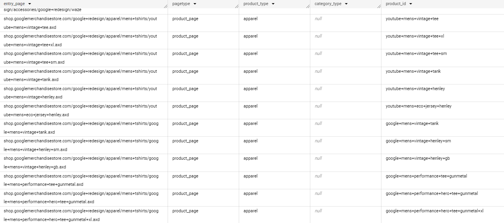

Our datawarehouse structure should now look something like this...

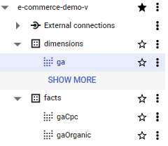

## Create a Product dimension table in our Dimension Dataset

Your organization most likely has valuable internal data specific to your product and taxonomy assortment.

The final dimension tables you should add revolve around internal or external dimension tables that can be joined to your fact/dimension tables on a given id.

In this example, we do not have a product information table for the google analytics products so I have provided a dummy data csv. Below are the steps I took to create it:

saved a list of distinct products from our ga dimensions table
    > select distinct product_id from `e-commerce-demo-v.dimensions.ga`

Here we assume that your company has an accurate table with product information that can be joined to the ga dims table.

I exported the sql results to a google sheet and applied the following functions:

    > price: =RANDBETWEEN(5,125)
    > title_length: =LEN(A2)
    > has description: =if(RAND()>0.5,TRUE,FALSE)
    > description_length: =IF(D2=TRUE,,RANDBETWEEN(50,350))
    > has_image: =if(RAND()>0.5,TRUE,FALSE)
    > lead_time: =RANDBETWEEN(1,5)
    > gender: =IF(REGEXMATCH(A2,"women"),"F",IF(REGEXMATCH(A2,"men"),"M",))

Then i exported the csv to the src/engineering/data_table_product_dimensions directory.

Run the main.py file after modifying the config file to your naming convention. You will now have a product dimension table.

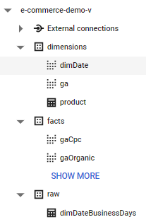

Voila! Let's get to work on joining these different sources into one source of truth

## A Quick Note on Naming Conventions

Above I see that the naming of my tables looks scattered and hard to discern.

Because I want to create a high-end data warehouse that will be fairly easy for others to understand and use, I want to quickly decide upon a naming convention for fact, dimension, and summary tables. 

We will be joining fact and dimension tables together so we should make sure the names are clear to understand as we join them here, and add numerous data sources in the future.

Our primary datasets look like this (\raw exists but let's not worry about this data's naming):

* dimensions
* facts
* summary

Let's add a prefix to each table based on it's dataset's first character.

ex: a table in the facts dataset should begin with 'f_'

I also don't like the look of title-case table names. I want to change from a title-case naming convention to separating lower-case words with underscores.

Hmmm.. now I notice that I cannot rename tables after I have created them. 

That's ok! It's good news that we have thought through this naming in the early stages and can now edit our existing saved views in a new tab and save them with our new naming convention.

Hmmm.. the product dimension table we just made was populated using python so how do we rename the table? Good thing we are using good programming practices and can simply modify our config.py file to rename our BigQuery table destination by simply changing the TABLE_NAME_STRING value. Next we rerun the script and accomplished our mission.

Here are my new table names after renaming tables in dimensions and facts datasets and deleting the old tables:

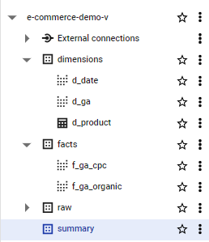

## Create a Summary Table for our Google Analytics Data

Next we will create a summary view that joins together our facts and dimensions.

Refer to src\sql\core\s_ga_organic.sql for join. 

Note that how we join matters a great deal. We wanted to add details to our ga organic table so we joined product information on our product id, and date groupings on the fact table's date field.

Note that with future data sources you will need to spend time reviewing the accuracy of your joins. For instance, if you are joining a source like Google Search Console that reports on pages AND queries, you will need to join your fact table to your dimension table where f_page=d_page AND f_query=d_query or else you will duplicate your summary table's records and explode your accuracy.

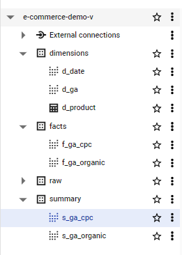

## A Note on Processing and Cost Saving

Your organization likely has large datasets of raw data. 

We have just structured a data warehouse that will allow us to modify column names at will and aggregate on differenct dimensions.

However, in the summary table views' current state, you may run into processing issues when trying to load the table into Business Intelligence tools like Google Sheets or Looker Studio.

You will run into this processing issue because we are accessing multiple tables and querying them each time we reference our summary tables.

The best way to correct this is to run a cost effective Scheduled Query each morning that saves to a "final_summary" dataset.

This will allow you to process a fraction of the data when loading a final_summary table into your BI tools.

Just make sure you configure your dates to a desired lookback window and your scheduled query runs once the most recent day's data has loaded.

For more information on how to do this, just Google "how do I schedule a query in Google BigQuery."

In this example, we have a small dataset, so I will skip this very helpful step.

## Recap

In this setup, we set our organization up for success in reporting on a single source of truth that we can modify simply in the future.

We learned how to:

* structure a data warehouse using a star schema methodology
* navigate Google BigQuery
* think through how to group date dimensions create page-specific dimensions to use later on
* use Python scripts to create tables in our data warehouse
* structure our Python modules to define variables we can modify for future use
* import Python pre-defined functions into our scripts in a way that allows us to re-use helpful code
* clearly label and name our data warehouse for clarity

In the introduction I listed two questions we should answer:

* Show me last week's kpis. Compare last week's kpis to the prior 4 week averages and trend the weekly totals over the past 12 months.

* Show me last month's revenue vs. the previous month. But wait - last month had 2 national holidays which skew our numbers to look lower. Control for these holidays.

We now have all the data we need to answer these questions!

In another repository, we will write Python modules that can answer these questions instantly.

We will format the modules in a way that allows us to dynamicaly update variables to answer additional questions using the same framework.