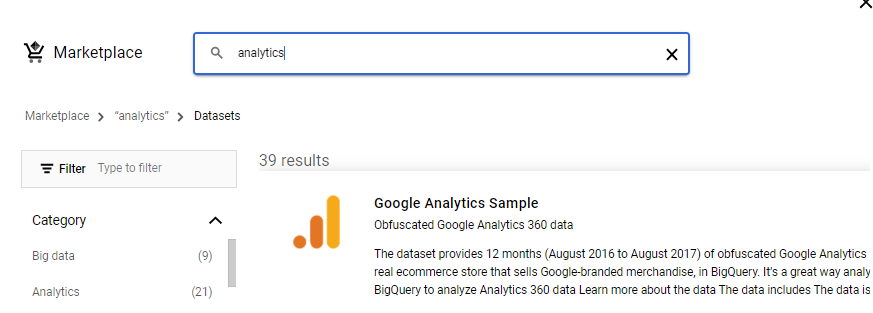

1. setup project

2. setup service account

Allow owner level access

Download and save. Not best practice, but we focus on action and document processes for future improvement.

3. activate bigquery

4. add public dataset

